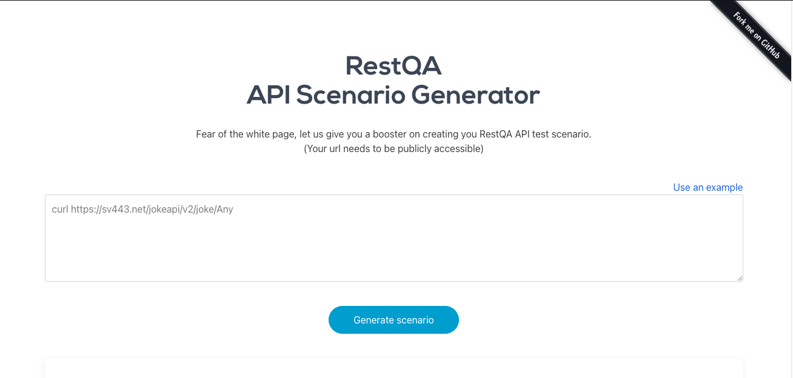

# Test automation Scenario for your APIs

## Description

In this project you will find a simple HTTP server exposing a website to generate RESTQA Test scenario from curl commands.

Take a look : [https://api2scenario.restqa.io](https://api2scenario.restqa.io)





## Good To Know.

This website is just a user interface for a native feature of RestQA.
If you want to know more about how the test scenrio are generated, take a look at the [documentation](http://docs.restqa.io/api/api-reference/)


## Development Guide.

### Getting started

Install the dependencies:

```js
npm i 
```

Start the server:

```js
npm run start:dev
```

#### Environement variables


| *Variable*                   | *Description*                                                                                                                                                    | *Default*          |
|:-----------------------------|:-----------------------------------------------------------------------------------------------------------------------------------------------------------------|:-------------------|
| `GIPHY_API_KEY`              | Required only if you want different spicy gif at each generatation [Giphy doc](https://support.giphy.com/hc/en-us/articles/360020283431-Request-A-GIPHY-API-Key) |                    |


And Voila!

